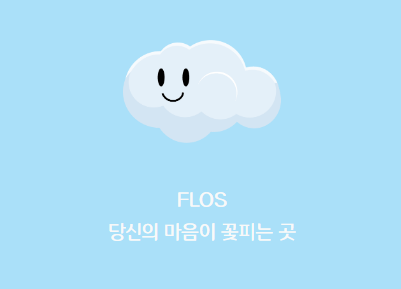
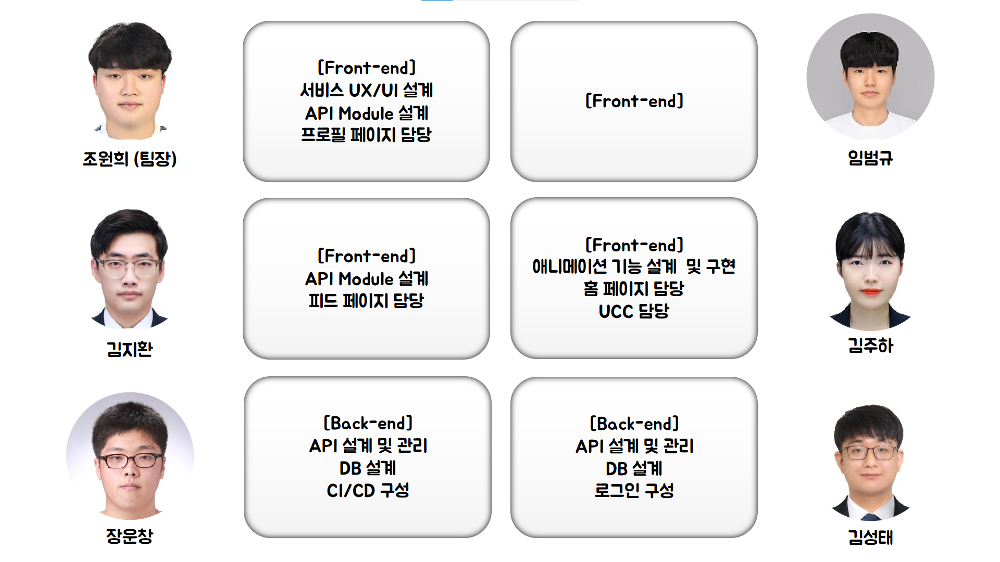

# 🌺  FLOS - 감정 공유 SNS



## FLOS 링크 : https://i8b210.p.ssafy.io

## UCC 링크 : 

## 🎬 프로젝트 기간

　2023. 01. 03. (화) ~ 2023. 02. 17. (금)

　SSAFY 8기 2학기 공통프로젝트 - FLOS

<br>

## 🌺 개요
---

### *나의 감정을 날씨로 공유하고 나만의 꽃을 키우자*

😀 Flos는 라틴어로 꽃을 의미합니다.

😬 Flos는 피드를 작성하고 내용을 분석해서 그에 맞는 감정을 추천하고 분석 내용이 마음에 들지 않으면 바꿀 수 있습니다.

😎 나의 감정이 등록된 피드를 다른 사람들과 공유해서 마음이 담긴 댓글을 달고 채택되면 꽃을 키울 수 있는 물과 햇빛을 얻을 수 있습니다. 꽃을 키우기 위해 활동을 많이 할 수 있고 활동을 많이 하는 유저는 다양한 꽃을 키워 정원을 풍성하게 채울 수 있습니다.

<br>

## 🌺 주요 기능
---
### * **가든**

  - 어쩌구
  - 저쩌구

<br>

## 🛠 주요 기술
---


**Back-end : Spring Boot**
```
- Springboot 2.7.8
- Spring Data JPA
- Spring Security
- Redis
- OAuth2
- Swagger 3.0.0
- MariaDB
```
**Front-end : REACT**
```
- 몰루?
```
**CI/CD**
```
- Jenkins
- Docker
- Nginx
- Letsencrypt
```

<br>

## 🚩 파일 구조

### back
```
  flos
  ├── auth
  │    └── model
  │         ├── dto
  │         ├── repository
  │         └── service
  ├── config
  ├── controller
  ├── exception
  ├── model
  │    ├── dto
  │    │    ├── request
  │    │    └── response
  │    ├── entity
  │    │    └── type
  │    ├── repository
  │    └── service
  └── util
```
### front
```
  fe
  └── src
       ├── api
       ├── assets
       ├── components
       ├── constants
       ├── hooks
       ├── pages
       ├── redux
       └── styles
```

## 🚀 협업 방식

  ### **Matter Most**
  - 평상시 소통을 위한 도구
  - 짧은 코드나 참조 url 공유
  ### **Notion**
  - Config 정리
  - 회의록 저장
  - 피드백 공유
  ### **Git lab**
  - 개발 코드 형상 관리
  - 메인, 작업 브랜치와 개인 브랜치 구분
  ### **Figma**
  - 기획 회의
  - 와이어 프레임 구성
  - 직접 화면을 구성하면서 회의
  ### **Jira**
  - 일정 관리


<br>

## 📋 팀원 역할 분배



<br>

## 🌺 결과물
 - [컨벤션](assets/convention.md)
 - [ERD](assets/erd.png)

## 🌺 이하 사용법 자세히

- gif 넣는게 좋아보임
- 말그대로 튜토리얼처럼