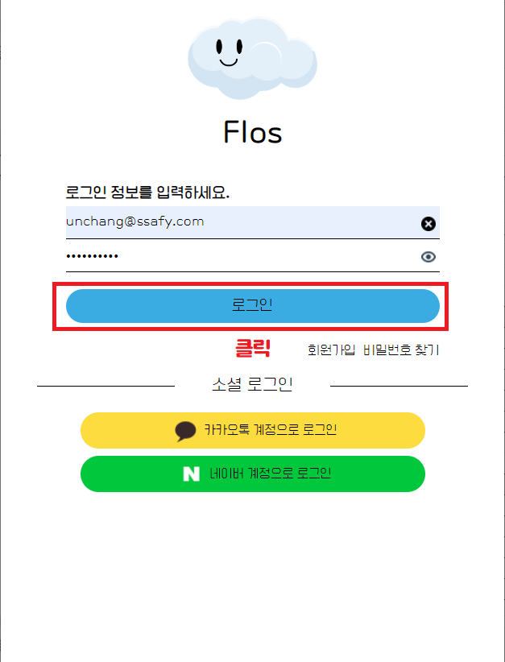
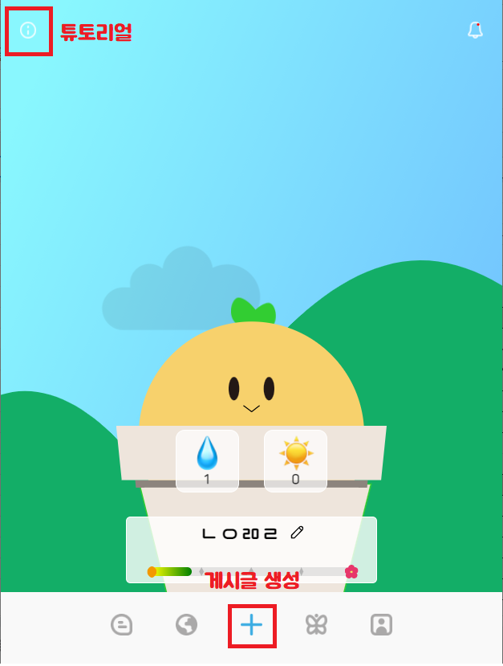
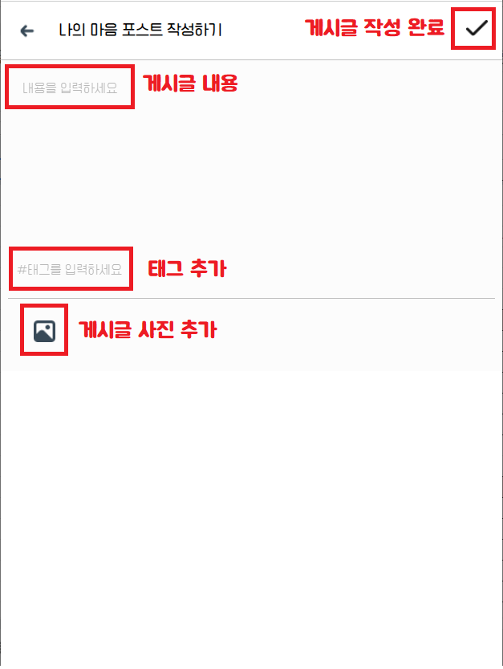
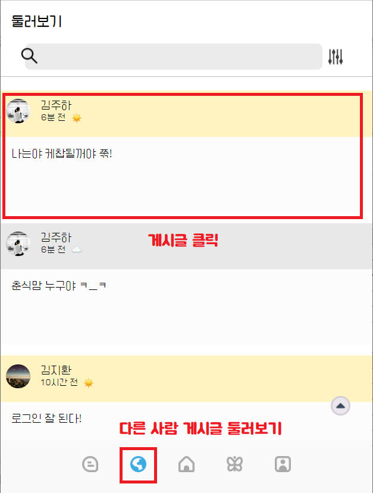
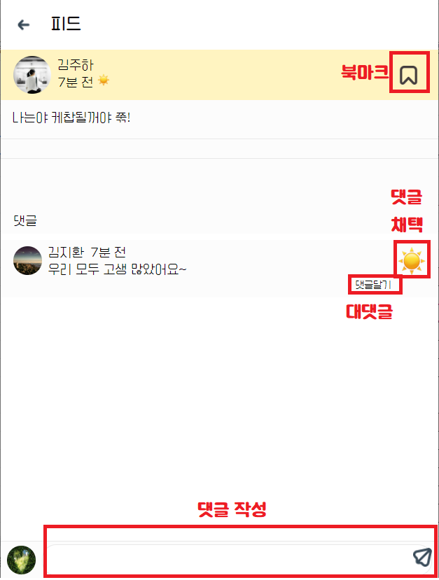
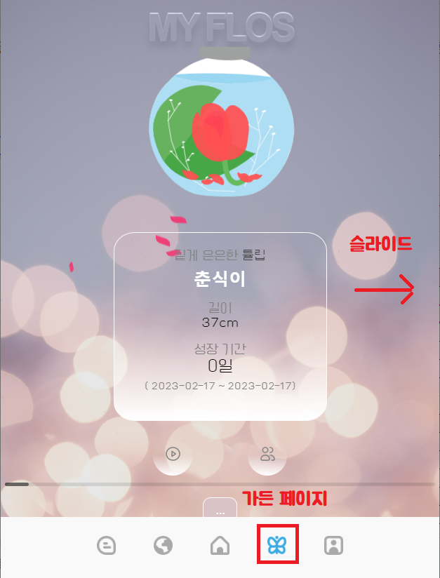
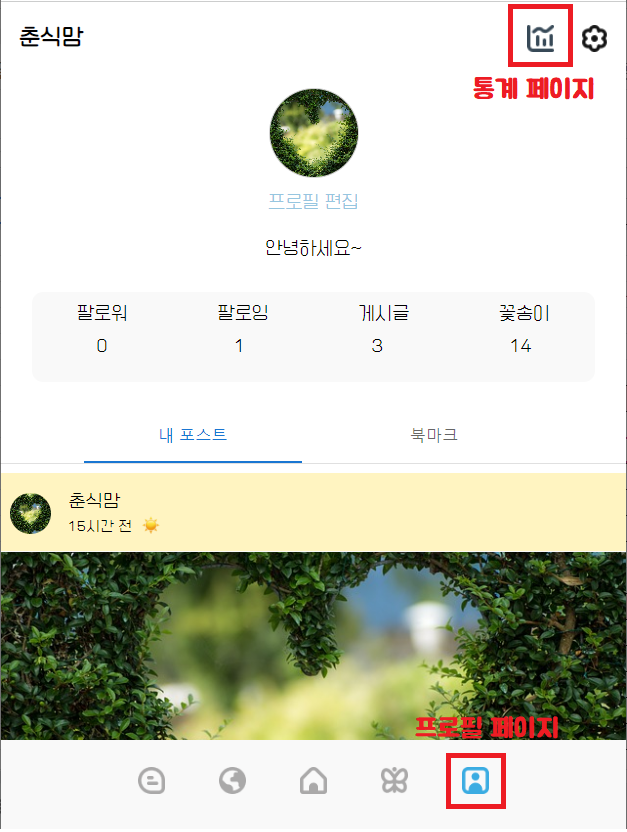
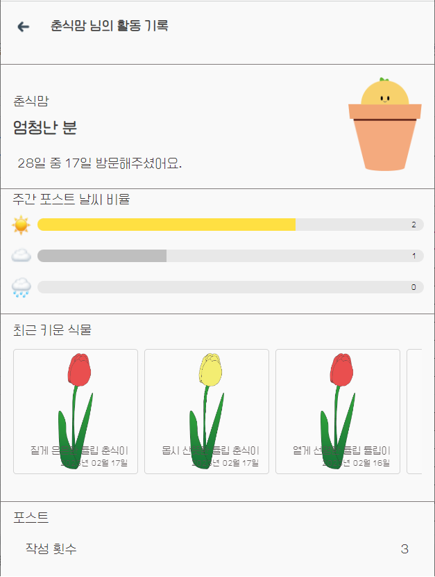

시연 시나리오 순서

1. 로그인
   

2. 홈 페이지
  - 좌측 상단 튜토리얼

3. 게시글 작성
  - 하단 nav바의 +버튼 클릭
  - 게시글 내용 입력하고 작성
  

4. 다른 게시글도 확인 가능
  - 게시글 클릭

5. 게시글 상세 페이지
  - 댓글 작성
  - 댓글 채택 가능

6. 가든 페이지
  - 하단 nav바의 나비 모양 버튼 클릭
  - 슬라이드로 넘김 가능

7. 프로필 페이지
  - 하단 nav바의 맨 오른쪽 버튼 클릭
  - 프로필에서 통계 페이지로 이동 가능

8. 통계 페이지
  - 활동 내역 및 통계 확인 가능

